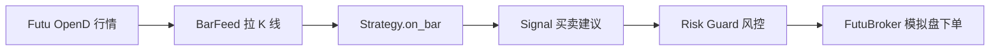

# 策略说明与 Agent 修改指南

本文说明 **当前内置策略如何工作**，以及 **如何告诉 Cursor Agent 修改或新增策略**。

相关代码：

- 策略实现：`src/strategies/sma_crossover.py`
- 策略配置：`config/strategies/sma_crossover.yaml`
- 策略框架：`src/strategy/base.py`
- 引擎调度：`src/engine/runner.py`

---

## 1. 系统如何运行（从行情到下单）

策略**不会直接下单**。它只输出「建议」，由引擎和风控决定是否执行。



| 步骤 | 谁负责 | 做什么 |
|------|--------|--------|
| 1 | **Data Layer** | 从 OpenD 订阅并拉取日 K 或 1 分钟 K |
| 2 | **Strategy** | 根据 K 线计算指标，产生 `Signal`（买/卖、数量、价格） |
| 3 | **Engine** | 用历史 K 线「预热」策略，**只对最新一根 K 线** 产生的信号下单 |
| 4 | **Risk Guard** | 检查白名单、单笔金额、持仓、冷却时间等 |
| 5 | **Futu Broker** | 在 **模拟盘**（`paper_only: true`）调用 Futu API 下单 |

**重要：** 当前所有交易都在 Futu **模拟盘**；策略层与执行层分离，换策略不必改 Futu 下单代码。

---

## 2. 当前策略：SMA 均线交叉（`sma_crossover`）

### 2.1 策略思想（用 plain language）

**SMA（Simple Moving Average）** = 简单移动平均线 = 最近 N 根 K 线收盘价的平均值。

本策略使用两条均线：

| 名称 | 默认参数 | 含义 |
|------|----------|------|
| **快线 fast SMA** | 10 根 K | 短期趋势 |
| **慢线 slow SMA** | 30 根 K | 长期趋势 |

**交易规则：**

1. **金叉（Golden Cross）→ 买入 BUY**  
   上一根 K：快线 ≤ 慢线  
   当前这根 K：快线 **>** 慢线  
   → 认为短期趋势转强，发出买入信号。

2. **死叉（Death Cross）→ 卖出 SELL**  
   上一根 K：快线 ≥ 慢线  
   当前这根 K：快线 **<** 慢线  
   → 认为短期趋势转弱，发出卖出信号。

3. **防重复**  
   同一标的若上一次已发过 BUY，不会连续再发 BUY（直到出现 SELL 后才会再 BUY）。

4. **数据不足时不交易**  
   至少需要 **30 根** K 线（`slow_period`）才开始计算；之前返回空信号。

### 2.2 图示（概念）

```
价格
  │         ╱ 快线 (10)
  │        ╱
  │    ───╱──── 慢线 (30)
  │      ╱
  │     ╱  ← 金叉：快线上穿慢线 → BUY
  └────────────────── 时间
```

### 2.3 当前配置（`config/strategies/sma_crossover.yaml`）

```yaml
name: sma_crossover
market: HK
symbols:
  - HK.00700          # 腾讯控股（可添加多只股票，见 2.7 节）
params:
  interval: "1d"      # 日 K（可改为 "1m" 做分钟级）
  fast_period: 10
  slow_period: 30
  qty: 100            # 每次信号买卖 100 股（每只标的相同）
```

### 2.7 多标的 Watchlist（添加更多股票）

完整说明见 **[WATCHLIST.md](WATCHLIST.md)**。要点：

1. **策略 watchlist** — `config/strategies/sma_crossover.yaml` → `symbols` 列表  
2. **风控白名单** — `config/settings.yaml` → `risk.allowed_symbols`（两处代码须一致）  
3. **Futu 格式** — `HK.00700`（5 位，非 `0700.HK`）

示例 watchlist：

```yaml
symbols:
  - HK.00700    # 腾讯
  - HK.09988    # 阿里
  - HK.02318    # 中国平安
  - HK.03690    # 美团
```

```yaml
# config/settings.yaml — risk.allowed_symbols.HK 须包含以上代码
```

```bash
.venv/bin/python scripts/run_paper.py --strategy sma_crossover --mode daily --market HK --once
```

### 2.4 产生什么样的订单？

策略输出 `Signal`，例如：

| 字段 | 示例 | 说明 |
|------|------|------|
| symbol | `HK.00700` | 标的 |
| side | `BUY` / `SELL` | 方向 |
| qty | `100` | 数量 |
| price | 收盘价 | **限价单**价格 = 当前 K 线收盘价 |
| reason | `SMA crossover BUY (fast=..., slow=...)` | 日志用 |

### 2.5 为什么有时「跑了策略但没有下单」？

以下情况**不会产生订单**，属于正常：

| 原因 | 说明 |
|------|------|
| **没有交叉** | 最新一根 K 线快慢线没有发生金叉/死叉（你 Phase C 测试就是这种情况） |
| **历史 K 线不够** | 不足 30 根，策略还在积累数据 |
| **风控拒绝** | 例如：非白名单标的、单笔超 `max_notional`、无持仓却 SELL、60 秒冷却 |
| **限价未成交** | 订单已提交模拟盘，但价格偏离市价，挂单未撮合（smoke test 用 400 限价而市价约 463 时） |

### 2.6 运行方式

```bash
# 日 K（默认）
.venv/bin/python scripts/run_paper.py --strategy sma_crossover --mode daily --market HK --once

# 1 分钟 K
.venv/bin/python scripts/run_paper.py --strategy sma_crossover --mode intraday --data 1m --market HK --once
```

---

## 3. 风控如何影响 SMA 信号

即使策略发出 BUY/SELL，**Risk Guard** 仍可能拦截。配置在 `config/settings.yaml`：

| 规则 | 当前默认值 | 效果 |
|------|------------|------|
| 标的白名单 | 见 `settings.yaml` → `allowed_symbols` | 不在名单 → 拒绝；须与策略 `symbols` 一致 |
| 单笔 notional 上限 | 100,000 | 价 × 量 超限 → 拒绝 |
| 无持仓卖出 | — | SELL 时持仓不足 → 拒绝（避免卖空） |
| 信号冷却 | 60 秒 | 同标的 60 秒内重复信号 → 拒绝 |

日志示例：

```
Signal rejected [HK.00700]: insufficient position to sell (have 0, need 100)
```

---

## 4. 策略在代码里长什么样（摘要）

核心逻辑在 `src/strategies/sma_crossover.py`：

1. 每来一根 K 线，把 `close` 加入 `_history`
2. 计算当前与前一根的 fast/slow SMA
3. 比较是否发生交叉
4. 若交叉且与 `_last_side` 不重复 → 返回 `Signal` 列表

策略**禁止**调用 Futu API；只返回 `list[Signal]`。

---

## 5. 如何告诉 Agent 修改或新增策略

### 5.1 原则

| 你可以让 Agent 改 | Agent 不应擅自改（除非你明确要求） |
|-------------------|-------------------------------------|
| `src/strategies/*.py` | `src/broker/`（下单） |
| `config/strategies/*.yaml` | `src/engine/`（调度） |
| `src/strategy/registry.py`（注册一行） | `trading.paper_only`（模拟盘锁） |
| `tests/test_*.py`（策略测试） | 实盘相关配置 |

在 Cursor 对话中提及 **「改策略」「新算法」「SMA」「RSI」** 等，Agent 会加载 **`algo-strategy`** Skill。

### 5.2 修改现有 SMA 策略 — 示例话术

**改 watchlist（多只股票）：**

> 请按 @docs/WATCHLIST.md 把我的 watchlist 设为 HK.00700、HK.02318、HK.03690、HK.09988，并更新白名单。

**改参数（最简单）：**

> 请把 `sma_crossover` 改成快线 5、慢线 20，每次买 200 股，标的改为 `HK.09988`，仍用日 K，在模拟盘测试。

**改逻辑：**

> 请修改 `sma_crossover`：只有 RSI < 30 时才允许 SMA 金叉买入；RSI 用 14 周期。参数放 YAML。

**改周期：**

> 请为 `sma_crossover` 增加一个 1 分钟版本配置 `sma_crossover_1m.yaml`，fast=10 slow=30，并说明如何用 intraday 运行。

### 5.3 全新策略 — 示例话术

把下面模板填好发给 Agent，信息越具体越好：

```markdown
请用 algo-strategy skill 新增一个策略：

**策略名：** momentum_breakout
**市场：** HK
**标的：** HK.00700
**数据：** 1 分钟 K
**逻辑：**
- 若收盘价突破过去 20 根 K 的最高价 → BUY 100 股
- 若收盘价跌破过去 20 根的最低价 → SELL 100 股（需有持仓）
**参数（放 YAML）：** lookback=20, qty=100
**要求：**
- 继承 BaseStrategy，只输出 Signal
- 注册到 registry，加单元测试
- 告诉我如何用 run_paper.py 在模拟盘测试
```

### 5.4 从其它 LLM 拿建议时 — 推荐流程

1. 把 **另一 LLM 的策略描述** 复制到 Cursor
2. 加上一句：**「请按 myAlgo2 的 BaseStrategy 接口实现，模拟盘 only。」**
3. Agent 应产出：
   - `src/strategies/<name>.py`
   - `config/strategies/<name>.yaml`
   - `registry.py` 注册
   - `tests/test_<name>.py`
4. 你本地运行：

```bash
make check
.venv/bin/python scripts/run_paper.py --strategy <name> --mode daily --market HK --once
```

### 5.5 使用 @ 引用（可选）

在 Cursor 里可 @ 这些文件，帮助 Agent 对齐项目规范：

- `@docs/STRATEGY_GUIDE.md` — 本文
- `@.cursor/skills/algo-strategy/SKILL.md` — 策略 Skill
- `@src/strategies/sma_crossover.py` — 现有示例
- `@AGENTS.md` — 架构边界

**示例：**

> @docs/STRATEGY_GUIDE.md @src/strategies/sma_crossover.py  
> 请参考 SMA 示例，新增 MACD 策略，HK.00700 日 K，模拟盘测试。

### 5.6 Agent 新增策略时的文件清单

| 文件 | 作用 |
|------|------|
| `src/strategies/your_strategy.py` | 策略逻辑 |
| `config/strategies/your_strategy.yaml` | 参数与标的 |
| `src/strategy/registry.py` | `"your_strategy": YourStrategyClass` |
| `tests/test_your_strategy.py` | 单元测试（建议） |

运行：

```bash
.venv/bin/python scripts/run_paper.py --strategy your_strategy --mode daily --market HK --once
```

---

## 6. 策略类型与 Runner 对照

| 策略需要什么数据 | 实现方法 | 运行命令 |
|------------------|----------|----------|
| 日 K | `on_bar(bar, "1d")`，`interval: "1d"` | `run_paper.py --mode daily` |
| 1 分钟 | `on_bar(bar, "1m")`，`interval: "1m"` | `run_paper.py --mode intraday --data 1m` |
| Tick | `on_tick(tick)`，`tick: true` | `run_tick.py --strategy ...` |

---

## 7. 常见问题

**Q: 策略和「手动 smoke test」有什么区别？**  
Smoke test 直接调用 Broker 下单，不经过策略和 SMA 逻辑。策略测试应看 `run_paper.py` 日志里是否有 `Signal` / `Order placed`。

**Q: 如何添加多只股票到 watchlist？**  
编辑策略 yaml 的 `symbols` 与 `settings.yaml` 的 `allowed_symbols`，详见 [WATCHLIST.md](WATCHLIST.md)。

**Q: 能否一个策略同时交易 HK 和 US？**  
可以，在 YAML 的 `symbols` 里写多个代码（需在 `settings.yaml` 白名单内）。Engine 会对每个 symbol 分别处理 K 线。

**Q: 代码格式是 0700.HK 吗？**  
否。Futu 使用 **`HK.00700`**（前缀 `HK.` + 5 位数字）。

**Q: Agent 会改我的实盘设置吗？**  
不会。`paper_only: true` 时禁止实盘；只有你明确说「切换实盘」时才应改。

**Q: 如何只改参数、不改代码？**  
只编辑 `config/strategies/sma_crossover.yaml`（如 `fast_period`、`qty`），然后重新 `run_paper.py`。

---

## 8. 相关文档

| 文档 | 内容 |
|------|------|
| [WATCHLIST.md](WATCHLIST.md) | **多标的 watchlist 与白名单配置** |
| [TESTING.md](TESTING.md) | 逐步测试模拟盘 |
| [AGENTS.md](../AGENTS.md) | Agent 分工与禁止事项 |
| [PRD.md](../PRD.md) | 产品功能设计 |
| [README.md](../README.md) | 项目总览 |

---

**总结：** 当前算法 = **双 SMA 金叉买、死叉卖**，参数在 YAML，执行走 **模拟盘 + 风控**。换新策略时，用第 5 节的话术告诉 Agent，并强调 **BaseStrategy + Signal + 模拟盘** 即可。
