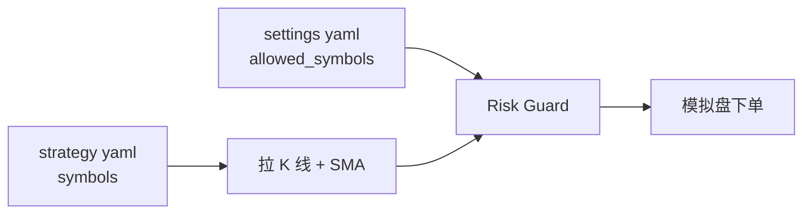

# Watchlist 配置指南 — 多标的观察列表

本文说明如何在 myAlgo2 中配置 **多只港股/美股** 作为策略 watchlist，并确保模拟盘能正常下单。

> **代码格式：** Futu 使用 `HK.00700`（不是 `0700.HK` 或 `700.HK`）。港股为 **5 位数字**，不足补零。

---

## 1. 两处配置（都必须改）

| 文件 | 字段 | 作用 |
|------|------|------|
| `config/strategies/<strategy>.yaml` | `symbols` | **Watchlist**：订阅行情、计算指标、产生信号 |
| `config/settings.yaml` | `risk.allowed_symbols` | **白名单**：风控允许下单的标的 |

只改策略 yaml **不够** — 不在白名单的标的会被拒绝：

```
Signal rejected [HK.02318]: symbol not in whitelist
```



---

## 2. Futu 代码格式

| 市场 | 格式 | 示例 |
|------|------|------|
| 香港 | `HK.` + 5 位代码 | `HK.00700` 腾讯、`HK.09988` 阿里、`HK.02318` 中国平安、`HK.03690` 美团、`HK.00005` 汇丰 |
| 美国 | `US.` + Ticker | `US.AAPL`、`US.MSFT`、`US.TSLA` |

**转换示例：**

| 常见写法 | Futu 正确写法 |
|----------|---------------|
| 0700 / 700 | `HK.00700` |
| 9988 | `HK.09988` |
| 2318 | `HK.02318` |
| AAPL | `US.AAPL` |

---

## 3. 策略 Watchlist — `config/strategies/sma_crossover.yaml`

在 `symbols` 下列出所有要监控的标的：

```yaml
name: sma_crossover
market: HK
symbols:
  - HK.00700    # 腾讯控股
  - HK.09988    # 阿里巴巴-SW
  - HK.02318    # 中国平安
  - HK.03690    # 美团-W
params:
  interval: "1d"
  fast_period: 10
  slow_period: 30
  qty: 100       # 每只标的每次信号的数量
```

**行为说明：**

- Engine 对 **每一只** 订阅行情并拉 K 线
- SMA 对 **每只独立** 维护均线历史，分别判断金叉/死叉
- 同一次运行中，多只股票可能各自产生 BUY/SELL（受风控约束）

运行命令不变：

```bash
.venv/bin/python scripts/run_paper.py --strategy sma_crossover --mode daily --market HK --once
```

---

## 4. 风控白名单 — `config/settings.yaml`

将 **相同代码** 加入 `risk.allowed_symbols`（本地文件，不进 Git）：

```yaml
risk:
  allowed_symbols:
    HK:
      - HK.00700
      - HK.09988
      - HK.02318
      - HK.03690
    US:
      - US.AAPL
      - US.MSFT
      - US.TSLA
```

复制模板时，可从 `config/settings.example.yaml` 同步结构：

```bash
# 若尚未有本地配置
cp config/settings.example.yaml config/settings.yaml
# 然后编辑 settings.yaml 中的 allowed_symbols
```

---

## 5. 港股 + 美股混合 Watchlist

可在同一 `symbols` 列表中混合（均需在两处 yaml 中配置）：

```yaml
# config/strategies/sma_crossover.yaml
symbols:
  - HK.00700
  - US.AAPL
```

```yaml
# config/settings.yaml
allowed_symbols:
  HK:
    - HK.00700
  US:
    - US.AAPL
```

**注意：**

- CLI `--market HK` 主要影响 **查询持仓** 时的市场过滤，不阻止 US 代码产生信号
- 混合市场时，建议熟悉后再用；纯港股 watchlist 用 `--market HK` 即可

---

## 6. 按 per-symbol 调整数量（可选）

当前 SMA 策略对所有标的使用同一个 `qty`。若需每只不同数量，可：

1. **改策略代码** 支持 `qty_map`（需 Agent 实现），或  
2. **拆成多个策略 yaml**（如 `sma_tencent.yaml` 仅 `HK.00700`，`qty: 200`）

告诉 Agent 示例：

> 请让 sma_crossover 支持 YAML 里 per-symbol 的 qty，例如 HK.00700=100、HK.09988=200。

---

## 7. 独立 Watchlist 配置文件（进阶）

若不想改动默认 `sma_crossover.yaml`，可复制为新文件：

**`config/strategies/my_hk_watchlist.yaml`**

```yaml
name: sma_crossover
market: HK
symbols:
  - HK.00700
  - HK.02318
params:
  interval: "1d"
  fast_period: 10
  slow_period: 30
  qty: 100
```

运行：

```bash
.venv/bin/python scripts/run_paper.py --strategy my_hk_watchlist --mode daily --market HK --once
```

`--strategy` 参数 = **yaml 文件名（不含 .yaml）**。策略类仍须在 `src/strategy/registry.py` 注册；同一 `SmaCrossoverStrategy` 可对应多个 yaml 文件名（需在 registry 中为 `my_hk_watchlist` 添加条目，或 Agent 帮你配置）。

---

## 8. 验证 Watchlist

1. **改完两处 yaml 后** 运行：

```bash
.venv/bin/python scripts/run_paper.py --strategy sma_crossover --mode daily --market HK --once --log-level INFO
```

2. 检查日志：
   - 无 `Subscribe failed for HK.xxxxx`
   - 无 `symbol not in whitelist`（若有 → 补全 `settings.yaml` 白名单）

3. 查模拟账户：

```bash
.venv/bin/python scripts/status.py --market HK
```

---

## 9. 请 Agent 帮你改 Watchlist

**示例话术：**

> 请把我的 watchlist 设为：HK.00700、HK.02318、HK.03690、HK.09988。更新 `sma_crossover.yaml` 和 `settings.yaml` 的 `allowed_symbols`，并告诉我如何测试。

或：

> @docs/WATCHLIST.md 请按文档添加 US.TSLA 到 watchlist 和白名单。

---

## 10. 相关文档

| 文档 | 内容 |
|------|------|
| [STRATEGY_GUIDE.md](STRATEGY_GUIDE.md) | SMA 策略原理与 Agent 改策略 |
| [TESTING.md](TESTING.md) | 模拟盘分步测试 |
| [README.md](../README.md) | 项目总览 |
